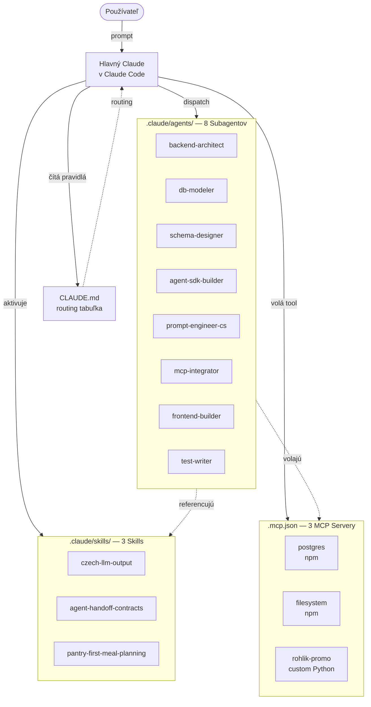
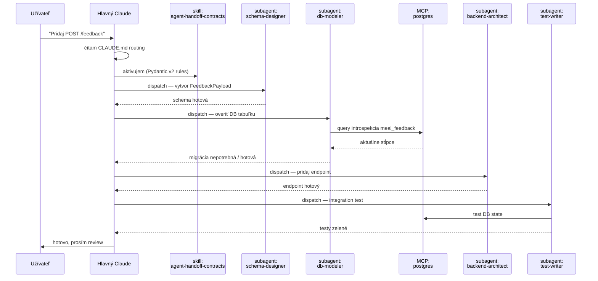

# ARCHITECTURE.md — Ako sa Subagenty + Skills + MCP servery spájajú

## Vysokoúrovňový diagram



## Mapping tabuľka — kto koho používa

| Subagent | Skills, ktoré používa | MCP servery, ktoré používa |
|---|---|---|
| **backend-architect** | `agent-handoff-contracts` | `filesystem` |
| **db-modeler** | `agent-handoff-contracts` | `postgres` |
| **schema-designer** | `agent-handoff-contracts` | `filesystem`, `postgres` |
| **agent-sdk-builder** | `agent-handoff-contracts`, `pantry-first-meal-planning`, `czech-llm-output` | `rohlik-promo`, `postgres` |
| **prompt-engineer-cs** | `czech-llm-output`, `pantry-first-meal-planning` | — |
| **mcp-integrator** | — | `rohlik-promo` |
| **frontend-builder** | `czech-llm-output` (UI texty) | `filesystem` |
| **test-writer** | `agent-handoff-contracts` | `postgres`, `rohlik-promo` |

**Pozorovanie:** Nie každý subagent používa všetky vrstvy. `mcp-integrator` napríklad nemá relevantný skill (jeho doména je iba MCP plumbing). `prompt-engineer-cs` zase nemá MCP server (jeho doména je čistý text). To je **správne** — ak by sme každému dali všetko, stratíme signál.

## Prečo táto trojica spolu

Tieto tri primitivy Claude Code sa **doplňujú**:

| Primitive | Sila | Slabina | Kompenzuje |
|---|---|---|---|
| **Subagent** | Špecializované kontext-okno, nezahltí hlavnú konverzáciu | Štatické — má pevný prompt, nereaguje na aktuálne dáta | MCP dodá runtime dáta |
| **Skill** | Aktivuje sa *na podnet*, vynúti pravidlo v správny moment | Nevykonáva — len inštruuje | Subagent vykoná, MCP dodá info |
| **MCP server** | Externý zdroj live dát (DB, filesystem, custom toolu) | Bez kontextu na ich použitie — len API | Subagent vie kedy ich použiť, Skill povie ako |

**Bez všetkých troch:** ak by sme mali iba Subagentov, hlavný Claude by hovoril *„rob X"* ale nevynútil by žiadnu konvenciu. Iba Skills bez Subagentov: Claude by sa vyčerpal pri kontextu pre veľké úlohy. Iba MCP: Claude má dáta ale nevie ako ich použiť konzistentne.

## Decision flow — kedy ktorý použiť

Pri každej úlohe sa pýtaj v tomto poradí:

```
Q1: Je úloha veľká / mimo aktuálneho kontextu hlavnej konverzácie?
    → ÁNO: dispatch Subagent (nezahltí hlavné context window)
    → NIE: pokračuj sám

Q2: Existuje pravidlo / konvencia, ktorá sa pri tomto type úlohy musí dodržať?
    → ÁNO: aktivuj Skill PRED akciou (vynúti pravidlo)
    → NIE: pokračuj

Q3: Potrebuješ runtime dáta (DB stav, filesystem, externý API)?
    → ÁNO: zavolaj MCP tool
    → NIE: hotovo, vykonaj
```

## Konkrétny príklad orchestrácie

**Scenár:** Užívateľ povie *„Pridaj endpoint POST /feedback pre uloženie hodnotenia jedla."*



## Súbory na hlbšie štúdium

- [CLAUDE.md](CLAUDE.md) — routing tabuľka + decision flow
- [.claude/agents/](.claude/agents/) — 8 subagent definícií
- [.claude/skills/](.claude/skills/) — 3 SKILL.md
- [.mcp.json](.mcp.json) — MCP server registrácia
- [mcp_servers/rohlik_promo/server.py](mcp_servers/rohlik_promo/server.py) — implementácia custom MCP servera
- [examples/](examples/) — 3 reálne transcripty
